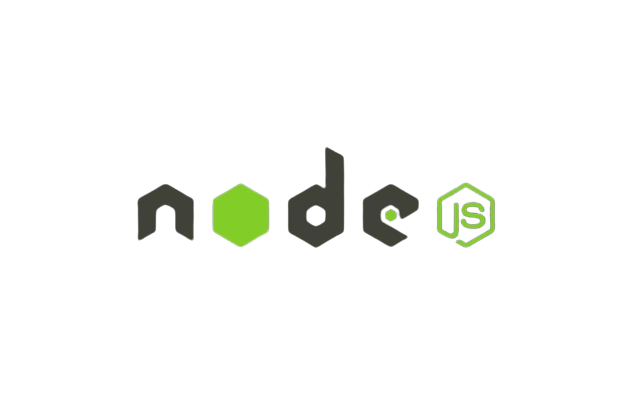

<div style="width: 80vw; margin: auto">
    
</div>

# Información 🐃

Aplicación backend para poder realizar un CRUD sencillo, conectado a una base de datos (local)

- Captura nuevas tareas (Create)
- Leer las tareas almacenadas (Read)
- Actualizar las tareas capturadas (Update)
- Eliminar tareas capturadas (Delete)

# Iniciar Servicio 🤯

Para poder realizar el uso de esta API vamos a tener ciertos servicios instalados en nuestro equipo tales como:

- [NodeJS](https://nodejs.org/en) v19.7.0 o versiones posteriores
- [Docker](https://docs.docker.com/) 24.0.5 o versiones posteriores "para levantar una base de datos local"

Es necesario antes de iniciar la aplicación, iniciar la base de datos, nos vamos a apoyar
de [Docker](https://docs.docker.com/),
Para levantar un contenedor con una base de datos NOSQL [MongoDB](https://www.mongodb.com/), las especificaciones de la
Versión de mongoDB
Se encuentran en el archivo de **Docker-compose.yml**.

Esto nos levantará un contenedor en [Docker](https://docs.docker.com/), con la configuración que se encuentra en el
archivo de **Docker-compose.yml**

```bash
Para iniciar la base de datos
docker compose up --detach
``` 

Para validar que el contenedor se levantó podemos, realizarlo en docker desktop o con el siguiente comando

```bash
docker container ls
``` 

- Después de ejecutar el contenedor, nos arroja él id del mismo y su información básica
- Nos estará creando una base de datos **dbtask**, a la cual podremos ingresar con los usuarios
    - root (ubicado en el archivo *docker-compose.yml*)
    - userTask (ubicado en el archivo *scripts/initDB.js*)

Ya que validamos que la base de datos se levantó ahora iniciamos el servicio web (API) para tareas

```bash
Instalamos las dependencias del proyecto
yarn install
```

```bash
Iniciamos la transpilación del código TS a JS
yarn watch:build
```

```bash
Iniciamos el proyecto
yarn prod:start
```

# Metodo Docker 🐋
Tambien puedes bajar la imagen del proyecto alojada en [Docker](https://hub.docker.com/r/helloalexis/api-task) y ejecutar la imagen

```bash
Bajamos la imagen 
docker push helloalexis/api-task:latest
```
Ya que bajamos la imagen lo validamos con 
```bash
docker image ls
docker push helloalexis/api-task:latest
```

```bash
Ahora nos queda ejecutar el contenedor de nuestro servicio
docker run -e MONGODB_URI=<uri mongodb> --publish 4000:4000 helloalexis/api-task:latest
```
Verificamos que se inicio el contenedor 
```bash
docker image ls
docker contaier ls
```
listo ya tenemos nuestra API con [Docker](https://docs.docker.com/), este contenedor expone el puerto **4000** para su conexion
y uso del API

- ## Author
- Alexis Torres
- ## Licencia
- [MIT licensed](LICENSE).